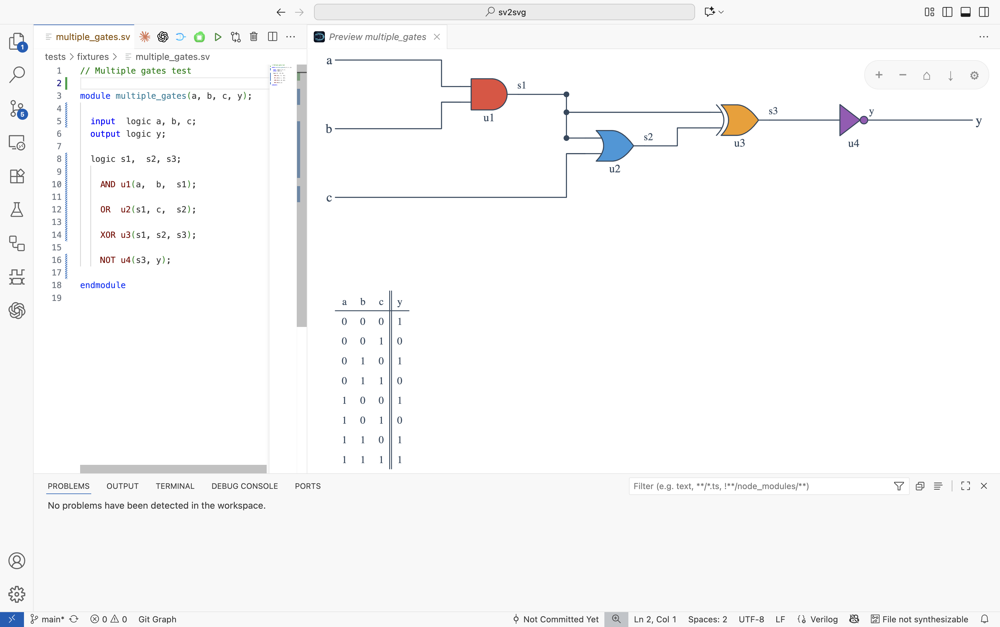

# Preview .sv

[](https://marketplace.visualstudio.com/items?itemName=easytocloud.preview-sv)
[](https://marketplace.visualstudio.com/items?itemName=easytocloud.preview-sv)
[](./LICENSE)

Preview .sv renders SystemVerilog source files as crisp SVG schematics right inside VS Code. It drives the excellent [`sv2svg`](https://pypi.org/project/sv2svg/) utility through `uvx`, keeping the preview in sync with the file you are editing.



## Highlights

- Side-by-side schematic preview that stays aligned with the active `.sv` or `.svh` file.
- Single shared preview panel: switch files, the preview follows without cluttering the UI.
- Auto-refresh on save, with an optional (debounced) live mode while you type.
- Flexible CLI configuration, including exclusion patterns for testbenches.

## Requirements

Preview .sv relies on tools that are *not* bundled with the extension. Make sure these commands work in the VS Code terminal:

| Tool | Why it is needed | Quick install |
| --- | --- | --- |
| [Python 3.9+](https://www.python.org/downloads/) | Runtime required by both `uv` and `sv2svg`. | Use your package manager or the official installer. |
| [`uv`](https://github.com/astral-sh/uv) | Provides the `uvx` helper that runs `sv2svg` straight from PyPI. | `pip install uv` (or follow the uv docs for faster installers). |

Once `uv` is installed, `uvx` downloads and caches `sv2svg` automatically on first use. If you prefer a locally installed `sv2svg`, you can point the extension settings to that binary instead.

## Getting Started

1. Install the extension from the Visual Studio Code Marketplace.
2. Open a SystemVerilog workspace (any `.sv` or `.svh` file will do).
3. Verify dependencies: run `uvx --version` in the terminal. If this fails, install `uv` and ensure Python is on your PATH.
4. Open the command palette (`Ctrl+Shift+P` / `⇧⌘P`) and run **SV2SVG: Open Preview to the Side**.
5. Edit and save your file—Preview .sv will re-render the schematic automatically.

Tip: you can enable auto preview so every `.sv` file you activate updates the shared panel instantly.

## Commands

| Command | Description |
| --- | --- |
| `SV2SVG: Open Preview` | Opens/focuses the preview next to the current editor. |
| `SV2SVG: Open Preview to the Side` | Same as above, explicitly opening beside the editor group. |
| `SV2SVG: Refresh Preview` | Forces a re-render of the current document. |
| `SV2SVG: Toggle Auto Preview` | Automatically open/update the preview as you switch `.sv` files. |

## Settings Overview

All settings live under **Preview .sv**.

| Setting | Default | Description |
| --- | --- | --- |
| `sv2svgPreview.runner` | `uvx` | Command that launches the toolchain. Point this to another wrapper if desired. |
| `sv2svgPreview.runnerArgs` | `[]` | Extra arguments passed before the command (e.g. `"--refresh"`). |
| `sv2svgPreview.command` | `sv2svg` | The subcommand executed by the runner. |
| `sv2svgPreview.args` | `["-o", "-"]` | Arguments appended after the file path. Defaults pipe SVG to stdout. |
| `sv2svgPreview.onSave` | `"refresh"` | Auto-refresh behaviour on save (`"refresh"` or `"off"`). |
| `sv2svgPreview.onChange` | `false` | Experimental live preview (writes a temp file while typing). |
| `sv2svgPreview.excludePattern` | `".*_tb\\.sv$"` | Regex of filenames that should not open in the preview (e.g. testbenches). |
| `sv2svgPreview.argsBeforeFile` | `false` | Place CLI args before the file path if your tool expects that order. |
| `sv2svgPreview.autoOnOpen` | `false` | Automatically open the preview when activating an `.sv` file. |
| `sv2svgPreview.renderTimeoutMs` | `15000` | Timeout for the render process in milliseconds. |

## Tips & Troubleshooting

- **Preview shows an error?** The webview displays stderr/stdout from `sv2svg`. Check the message—often it means `uvx` could not find Python or the CLI emitted a syntax error.
- **Need to pass custom flags?** Use `sv2svgPreview.args` or `runnerArgs`. For example, set `runnerArgs` to `["--refresh"]` to force `uvx` to re-download the latest package.
- **Workspace trust:** VS Code must trust the workspace to execute external commands. Grant trust if prompted.
- **Live preview performance:** Debounced live rendering writes your unsaved buffer to a temp file. Disable it if you edit extremely large designs.

## Building & Contributing

Clone the repository, then:

```bash
npm install
npm run compile
# Run the extension host
code --extensionDevelopmentPath=.
```

You can also use the provided `Makefile` to package and publish releases via `make package` or `make publish-patch`.

Found a bug or have an idea? Open an issue at [easytocloud/preview-sv](https://github.com/easytocloud/preview-sv/issues).

---

With gratitude to **Antonia** for introducing me to SystemVerilog and sparking the desire to build this preview.
